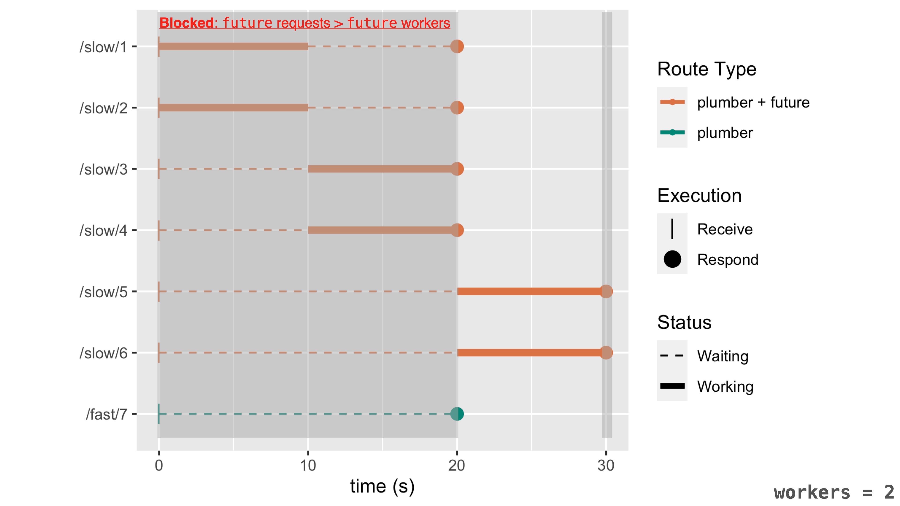

Be sure you are comfortable with the main concepts in [Launching tasks with future](future.html).

This article references `plumber`. To learn more about `plumber`, please visit its website: [www.rplumber.io/](https://www.rplumber.io/).

-----------------------


When using the `future` package, the result of `future::future()` can be upgraded to a `promise` object by using the promise pipe (`%...>%`).  For example:

```r
prom_1 <-
  future::future({ expensive_operation() }) %...>%
  local_promise_operation()
```

Since the release of [`plumber`](https://www.rplumber.io/) v1.0.0, `plumber` allows for routes to return a _promising_ object and will wait until the _promising_ object is resolved before continuing with the route execution.  `plumber` checks for _promising_ objects using `promises::is_promising()`, which returns `TRUE` for both `promises::promise()` and `future::future()` objects.

In both cases, the result of the promising object is executed in a followup promise.  `promises` is built on top of `later`, which only executes when the main R session is _free_ (or allowed to execute `later::run_now()`). These are **key** bits of information for the remainder of the document.

Note: The same benefits of using `future_promise()` within `plumber`, described below, would also apply to using `future_promise()` with any other R package that continues to execute `later::run_now()`, such as `shiny`.


## `future::future()`

In an ideal situation, the number of available `future` (>= 1.21.0) workers (`future::nbrOfFreeWorkers()`) is always less than the number of `future::future()` requests.  If a `future` request is executed when the number of free workers is `0`, then `future` will block the current R session until a worker becomes available.

Let's set up an example of seven `plumber` requests being received at the same time.  The first six requests will be processed using `future::future()` and the final request will be processed in the main R session. The trailing number at the end of each request is the request's arrival order.  Assuming the `future` work takes ~10s to compute, the execution timeline would look like:

{width=75%}

While the overall time is faster than if the requests were serially executed, the turn around time for earlier routes (e.g. `/slow/1`) will be longer than expected. This is because the main R session is blocked waiting for a `future` worker to become available.  Blocking the main R session prevents
* any remaining `plumber` requests from being processed
* any pending `promises` objects (or `later` callbacks) from being executed, such as responding to a `plumber` route executed by `future`.

{width=75%}

The video below animates how the main R process has to wait for `future` workers to become available before being able to process the next incoming `plumber` request:

```{r, echo = FALSE}
library(vembedr)
embed_vimeo("505287449") %>%
  use_align("center")
```

## `future_promise()`

`future_promise()` is a _promise_ to execute the expression using `future::future()` and returns a `promises::promise()`, rather than the original `future::future()` object.  `future_promise()` will resolve to the final value of the execution of `future::future()`.

The advantage of `future_promise()` is that it will not submit `future` work unless a `future` worker is available. This keeps the main R session available as much as possible. If no workers are currently available, `future_promise()` will continue to periodically check for a worker to become available.

Continuing with the same example, we can swap out the calls to `future::future()` with `future_promise()`.  In the timeline plot below, the `/fast/7` route will not have to wait on any `future` work to finish processing. The only times where the main R session was blocked was the initial requests submissions, creating the `future_promise()` promises, and resolving the `future_promise()` response.  All other times were available for other `promises` objects (or `later` callbacks) to execute.

{width=75%}

The video below animates how `future_promise()` will use a waiting queue to submit work to executing using `future`:

```{r, echo = FALSE}
library(vembedr)
embed_vimeo("505286442") %>%
  use_align("center")
```


## Variable scope in `future_promise()` and `future::future()`

`future_promise()` is a promise **first** and executes using `future::future()` **second**. `future_promise()` should use the same precautions that you would use with a regular `promises::promise()`.

With `future` blocking on the main R session, this prevents values from being changed before they are submitted to the external worker.  While a promise waits to be executed, it is known that variables that have not been forced or properly scoped can change from their expected values before evaluation occurs. This can also occur with properly scoped environment values as only the _pointer_ to the environment is static. This allows for the values within the environment to be altered before the promise is executed.


#### Scope

In the example below, the variable `i` is not forced to a specific value for the promise. With the promise resolving within the global environment, the latest `i` value will be used for all of the promises waiting to resolve.

```r
items <- list()
for (i in 1:10) {
  items <- c(items, list(
    promise_resolve(TRUE) %...>% {i}
  ))
}
promise_all(.list = items) %...>%
  { print(unlist(.)) }
# #> [1] 10 10 10 10 10 10 10 10 10 10
```

To combat variable scoping issues, functions can be used to create local environments that will _scope_ the expected `i` value.

```r
lapply(1:10, function(i) {
  promise_resolve(TRUE) %...>% {i}
}) %>%
  promise_all(.list = .) %...>%
  { print(unlist(.)) }
#> [1]  1  2  3  4  5  6  7  8  9 10
```


#### Changing environments

Environments can have their values changed after the original promise creation.  This can cause unexpected behavior when evaluating a promise.

For example, the environment `env` below will have its value `a` changed from `1` to `2` before the promise is resolved.  This causes the unexpected value of `2` to be returned in the promise.
```r
{
  env <- new.env()
  env$a <- 1

  promise_resolve(TRUE) %...>%
    { Sys.sleep(1); env$a } %...>%
    { print(.) }
  env$a <- 2
  print("Changed env$a")
}
#> [1] "Changed env$a"
#> [1] 2
```

To address lazy evaluation and environment variable issues, we can store the values to a local variable and force their evaluation.

Fixing the example, we can capture the value `a` (or turn the environment into a `list()`).
```r
{
  env <- new.env()
  env$a <- 1

  a_value <- force(env$a)
  promise_resolve(TRUE) %...>%
    { Sys.sleep(1); a_value } %...>%
    { print(.) }
  env$a <- 2
  print("done")
}
#> [1] "done"
#> [1] 1
```

The expression in `future_promise(expr)` will behave like a promise and should have its volitile variables scoped and `force()`ed to achieve similar evaluations when using `future::future()` directly.
